# How to install password manager on Windows Server 2016


**1. Set hostname, install IIS 10, open 5353 port.**

Press “Win+X”, then “Y” and change default hostname. 
Change server hostname to “passwork” to enable “passwork.local” domain in your private network.


To complete changes reboot the server.


Open “Server Manager” and add “Web Server (IIS)” role.

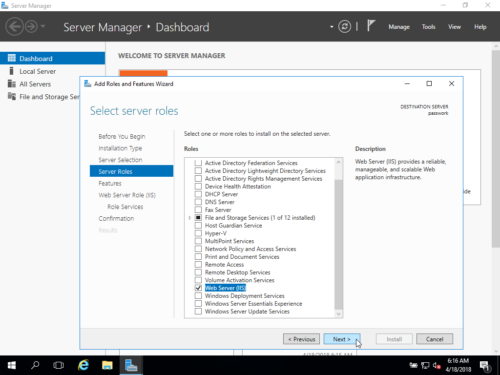

Allow inbound UDP connection for private networks on 5353 port in firewall settings.

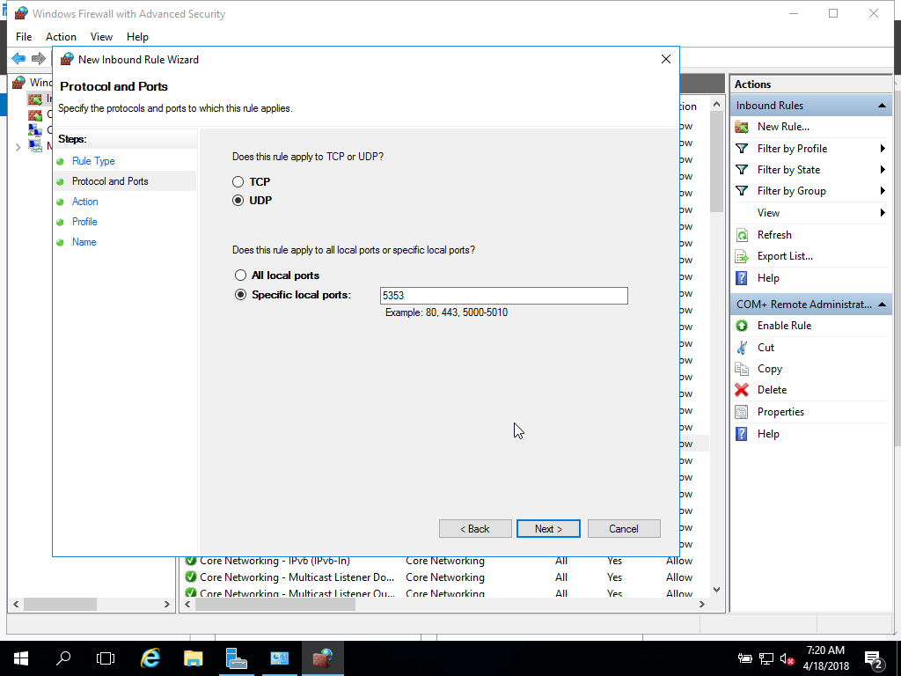

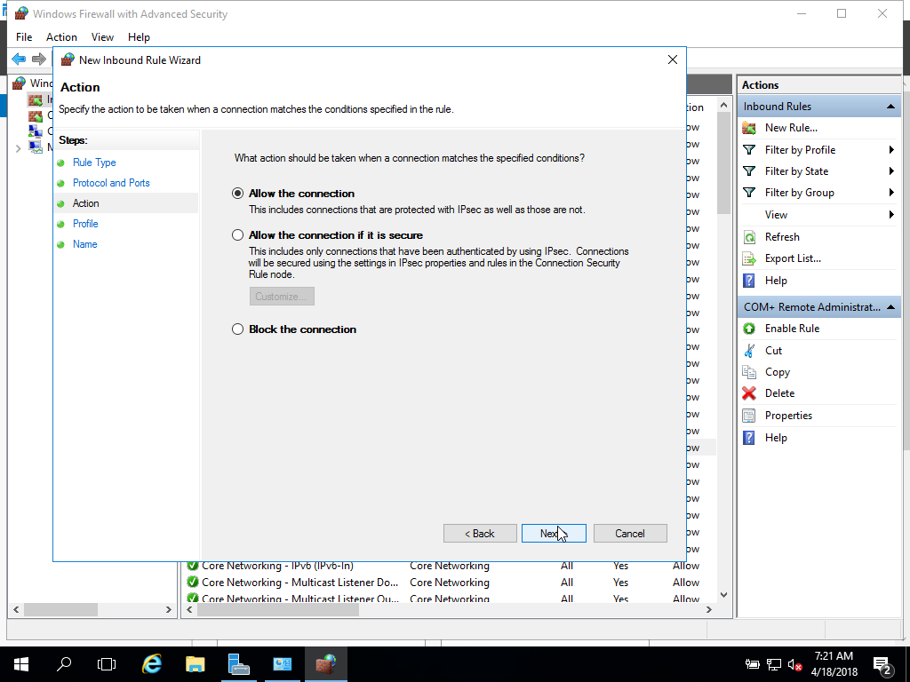

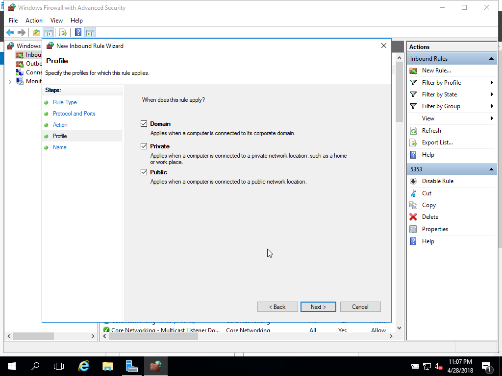


**2. Install MongoDB database.**

Open link [https://www.mongodb.com/download-center](https://www.mongodb.com/download-center) choose “Community Server”, “Windows”, click on “Download”. Then click “Save”. MongoDB installation package will be downloaded. Click “Run” to start installation process.

Notice: Reduce the security level of IE before downloading. Enable "Active Scripting" and "Download" options.


Click “Next”, then accept terms, again click “Next”. Select “Complete” installation.


Tick off “Install MongoDB Compass”. Click “Next” then “Install” to start installation process.


Click “Finish” after installation ends.


**Fix the Windows firewall.**

Go to your “Control Panel” and then click on “System and Security”. Once there, click on “Windows Firewall”.

You should now see your Windows firewall like this:

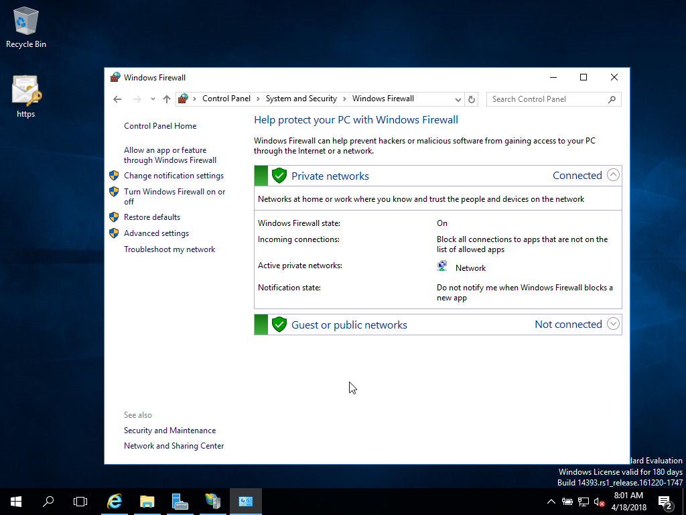

Click on “Allow an app or feature trough Windows Firewall”, your window will change. Click on “Allow another app.” -> click “Browse” and add MongoDB Database Server application "C:\Program Files\MongoDB\Server\3.6\bin\mongod.exe", then click "Add" and "Ok".


**Configure a Windows Service for MongoDB Community Edition.**

Create directories for your database and log files:
Open Command Prompt. Press “Win+X”, then press “a” key. Run:

```
md \data\db
```
and 
```
md \data\log
```
commands.


**Create a configuration file.**

Create a file “C:\Program Files\MongoDB\Server\3.6\mongod.cfg” that specifies both systemLog.path and storage.dbPath:

```
systemLog:
    destination: file
    path: c:\data\log\mongod.log
storage:
    dbPath: c:\data\db
```


**Install the MongoDB service.**

Run all of the following commands in Command Prompt with “Administrative Privileges” (open command prompt. Press “Win+X”, then press “a” key).

Run:
```
"C:\Program Files\MongoDB\Server\3.6\bin\mongod.exe" --config "C:\Program Files\MongoDB\Server\3.6\mongod.cfg" --install
```


**Start the MongoDB service.**

```
net start MongoDB
```


**Verify that MongoDB has started successfully**

Verify that MongoDB has started successfully by checking the log file at c:\data\log\mongod.log for the following line: [initandlisten] waiting for connections on port 27017


**3. PHP installation.**

We will use Web Platform Installer for PHP installation, so open IE and go to [https://www.microsoft.com/web/downloads/platform.aspx](https://www.microsoft.com/web/downloads/platform.aspx) URL to install the extension.


Then click “Run”.

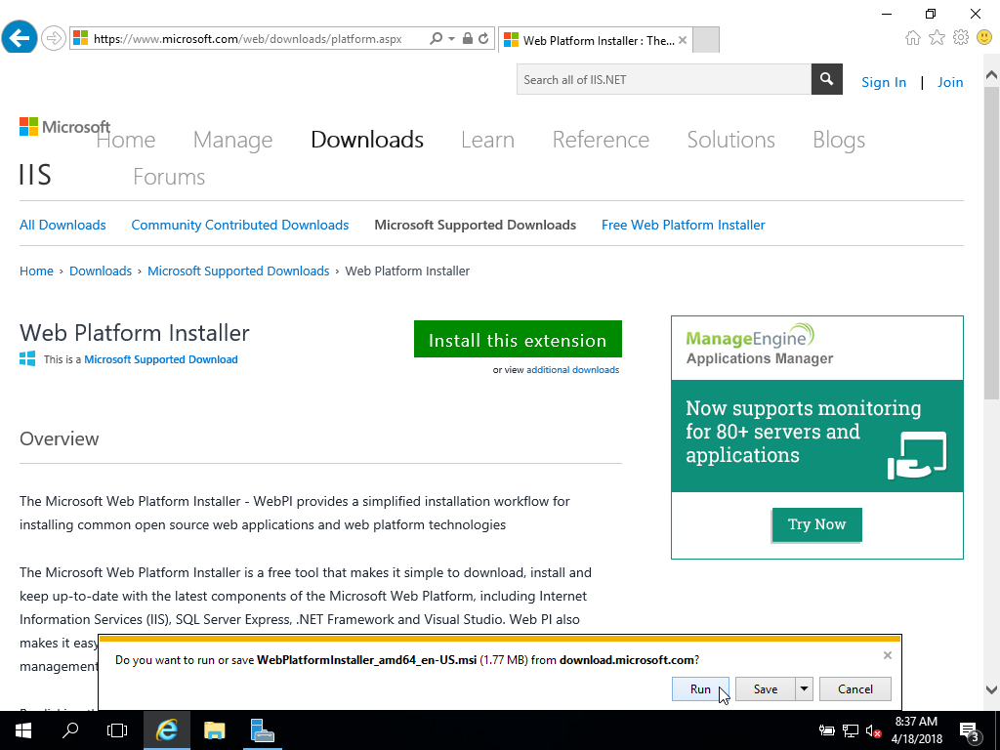

Accept terms and press “Install”. Press “Finish” after installation ends.


Open “Server Manager”, go to “Tools” and click on “Internet Information Services (IIS) Manager”, select server and double click on “Web Platform Installer”.


Go to “Products” tab and search for PHP. Select PHP 5.6.31 from the list and press “Add”. Then press “Install” and accept third party license terms.

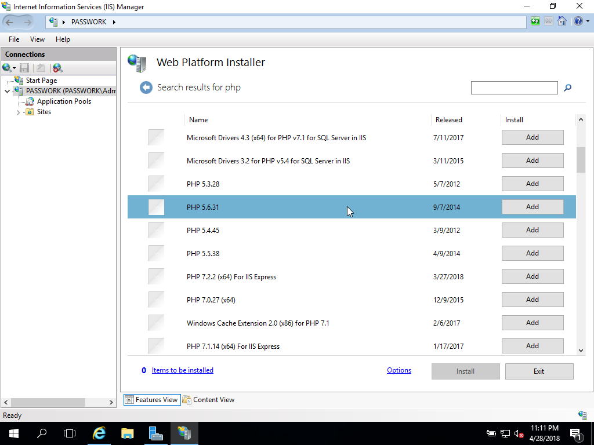

You will see PHP Manager for IIS failed to install, this notice can be ignored. Click “Finish”. Click “Finish”.


**4. Installing the Legacy MongoDB PHP Driver, Phalcon Framework and enabling additional extensions and options.**

Go to [https://windows.php.net/downloads/pecl/releases/mongo/1.5.1/php_mongo-1.5.1-5.6-nts-vc11-x86.zip](https://windows.php.net/downloads/pecl/releases/mongo/1.5.1/php_mongo-1.5.1-5.6-nts-vc11-x86.zip) to download Legacy MongoDB PHP Driver.

Go to [https://github.com/phalcon/cphalcon/releases/download/v3.3.2/phalcon_x86_vc11_php5.6.0_3.3.2_nts.zip](https://windows.php.net/downloads/pecl/releases/mongo/1.5.1/php_mongo-1.5.1-5.6-nts-vc11-x86.zip) to download Phalcon Framework.

Extract the “php_mongo-1.5.1-5.6-nts-vc11-x86.zip” archive and copy “php_mongo.dll” to “C:\Program Files (x86)\PHP\v5.6\ext”.

Extract the “phalcon_x86_vc11_php5.6.0_3.3.2_nts.zip” archive and copy “php_phalcon.dll” to “C:\Program Files (x86)\PHP\v5.6\ext”.

Open “C:\Program Files (x86)\PHP\v5.6\php.ini” in Notepad and add to the [Extension List] section the following lines:

```
extension=php_mongo.dll
extension=php_phalcon.dll
extension=php_ldap.dll
```


Save modifications and close the Notepad.


**5. Download and install passwork.**

Open repository URL in IE browser [http://get.passwork.pro:81/](http://get.passwork.pro:81/) Sign in using provided Login and Password.

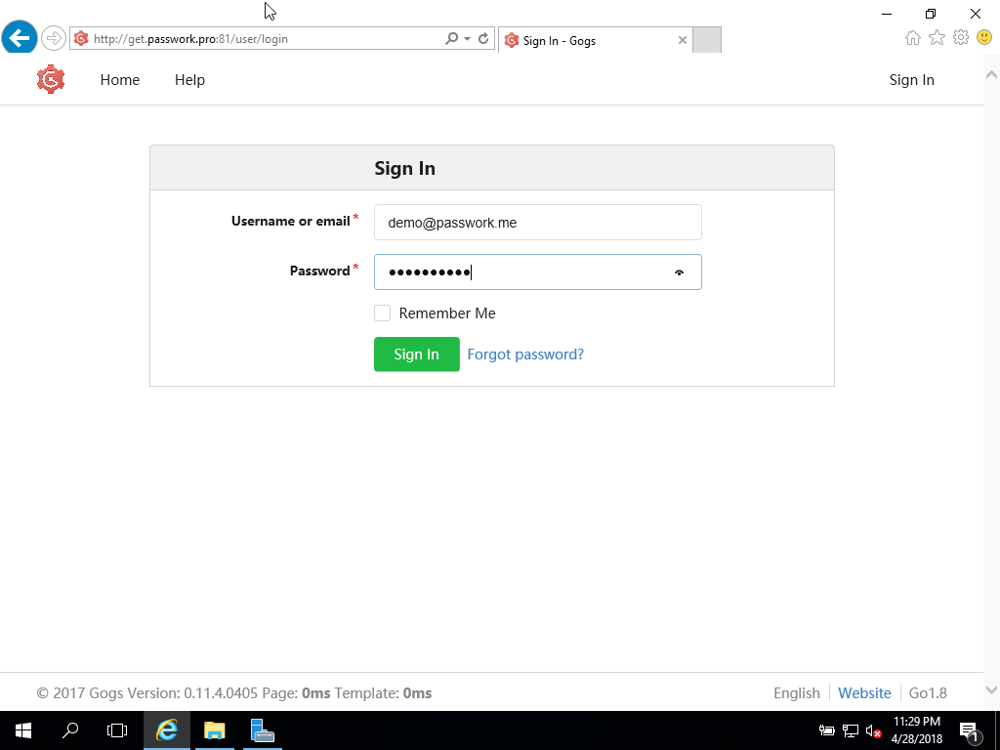

Choose “passwork” repository.


Then click on download icon and select ZIP option.


Extract archive and copy content of passwork folder to “C:\inetpub\wwwroot\” directory.


**Create config file.**

Create a copy of the “C:\inetpub\wwwroot\app\config\config.example.ini” in “C:\inetpub\wwwroot\app\config\” and rename it to “config.ini”.


**Set correct permissions.**

Open IIS Manager, then right click on website and click “Edit permissions”.

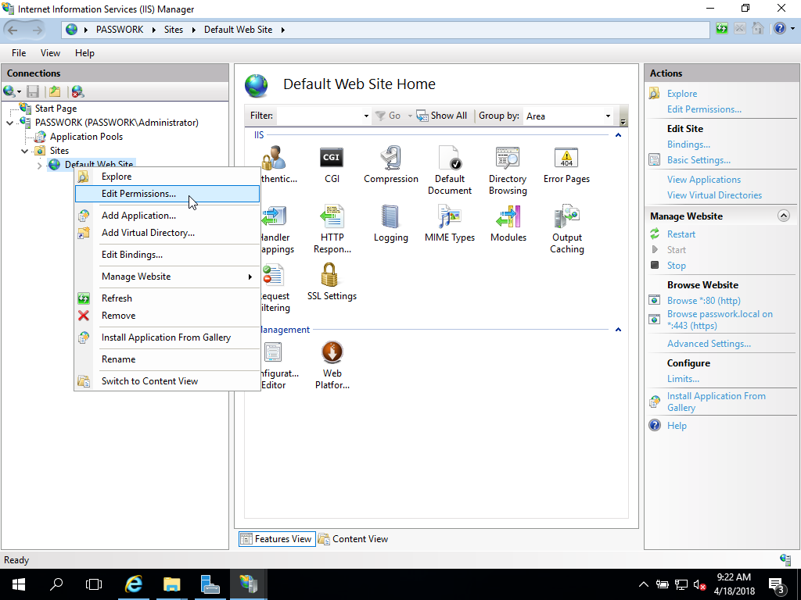

Press “Edit”, then “Add” and search for “IUSR” object. Select “IUSR” and grant “Write” permissions then click “Ok” twice.


**Change website physical path.**

Right click on “Default Web Site” > “Manage Website” > “Advanced Settings”. Change website physical path to “C:\inetpub\wwwroot\public\”, then click “Ok”.


**Restore MongoDB database.**

Open Command Prompt. Press “Win+X”, then press “a” key.

Run the following commands:

```
cd C:\Program Files\MongoDB\Server\3.6\bin
```
```
mongorestore --db pwbox C:\inetpub\wwwroot\dump\pwbox
```


The passwork database will be created.


**Rewrite rules**

Using “Web Platform Installer” install “URL Rewrite” module.


Close IIS Manager and open it again, select website. Double click on “URL Rewrite” icon. Click “Import rules” and select .htaccess file from website root directory, then click “Open” and “Import” buttons.


Click “Apply” button once imported.


**License installation.**

Extract archive with registration keys and move "demo.openssl.lic" and "reginfo.php" to "C:\inetpub\wwwroot\app\keys\" directory.


Open [http://passwork.local](http://passwork.local) to access website.

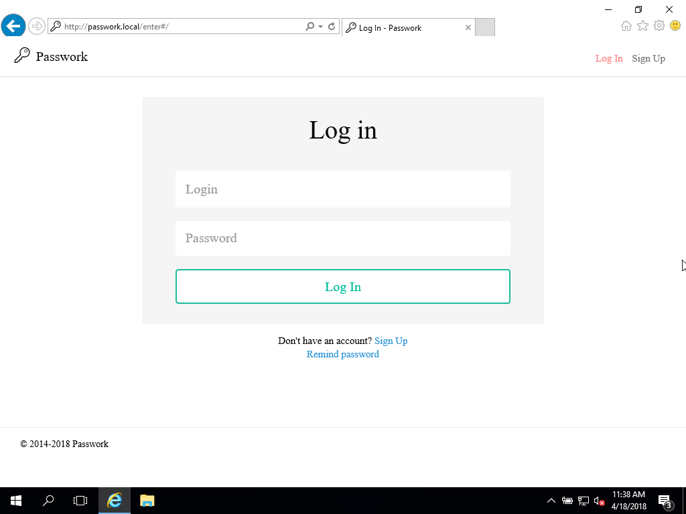


**Use default account to sign in:**

login: `admin@passwork.me`

pass: `DemoDemo`


**6. Configure SSL certificate on IIS 10.**

Open “Server Manager”, go to “Tools” and click on “Internet Information Services (IIS) Manager”, select server and double click on “Server Certificates”, then import certificate.

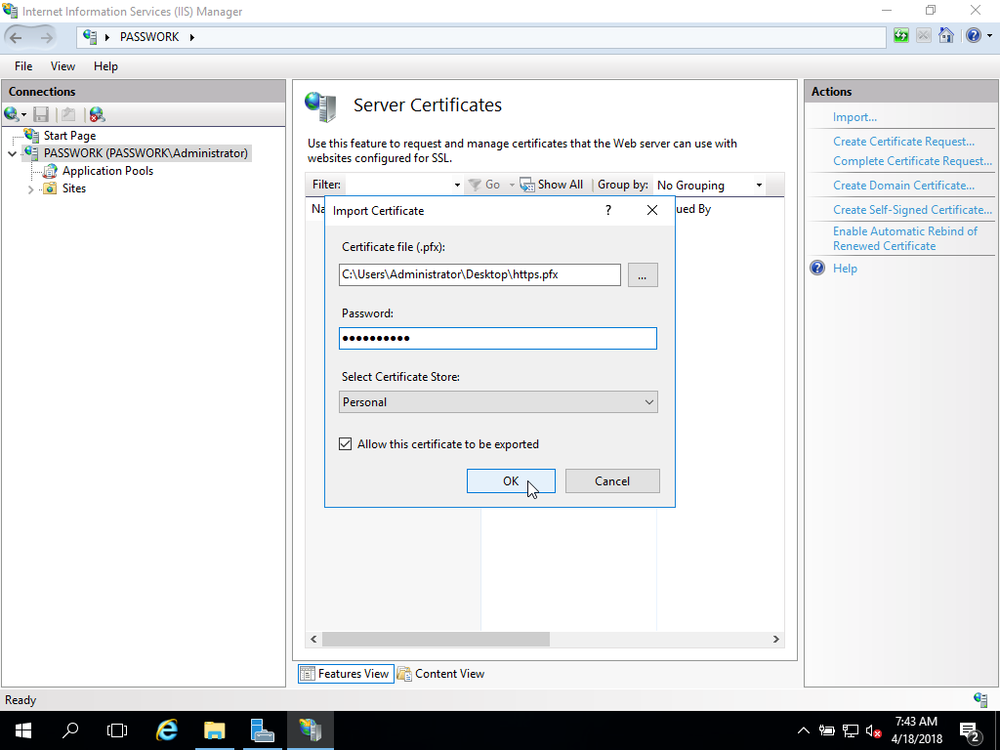

Go to sites, select your site and click “Bindings”. Select “https” protocol from drop-down list. Enter hostname “passwork.local”. Select SSL certificate from the list (in our case cert name is “https”).

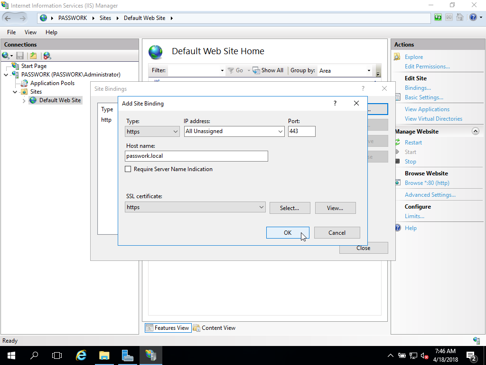

Then click “Close”.

Check SSL connection by going to [https://passwork.local](https://passwork.local).


**7. SMTP server install.**

Open “Server Manager” and add “SMTP Server” role.


Open IIS 6.0 Manager and configure SMTP server.

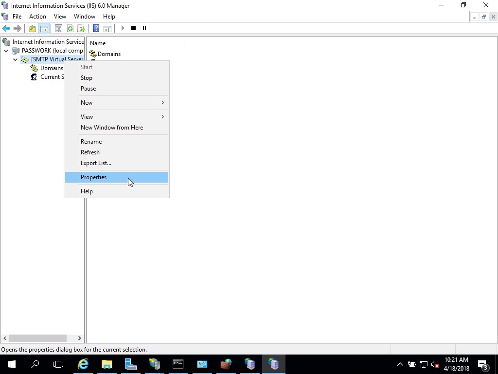

Open “Delivery” tab click on “Advanced” button and set “Smart host”. For Gmail it is “smtp.gmail.com”.

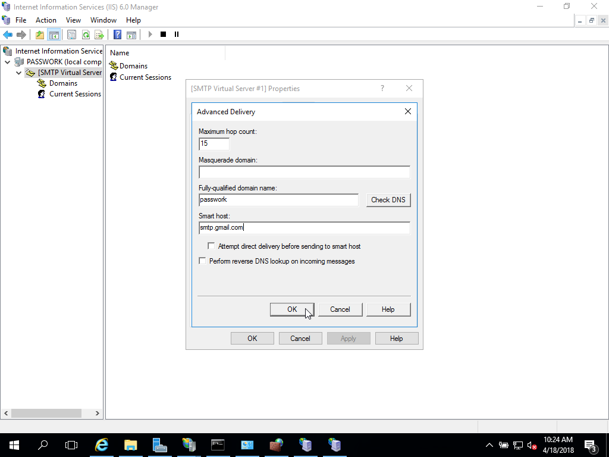

Click on “Outbound connections” and set outbound TCP port to “587”.

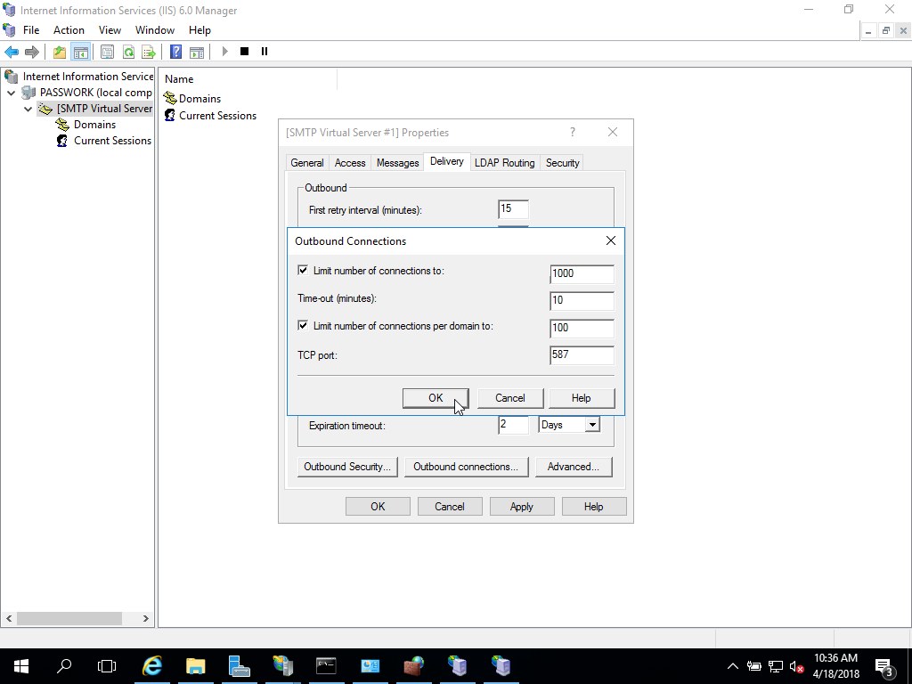

Click on “Outbound Security” button, select “Basic Authentication” and fill in user name and password fields. Tick on “TLS Encryption”.


Click on “Access” tab > “Connection” and add 127.0.0.1 ip to granted computers list.

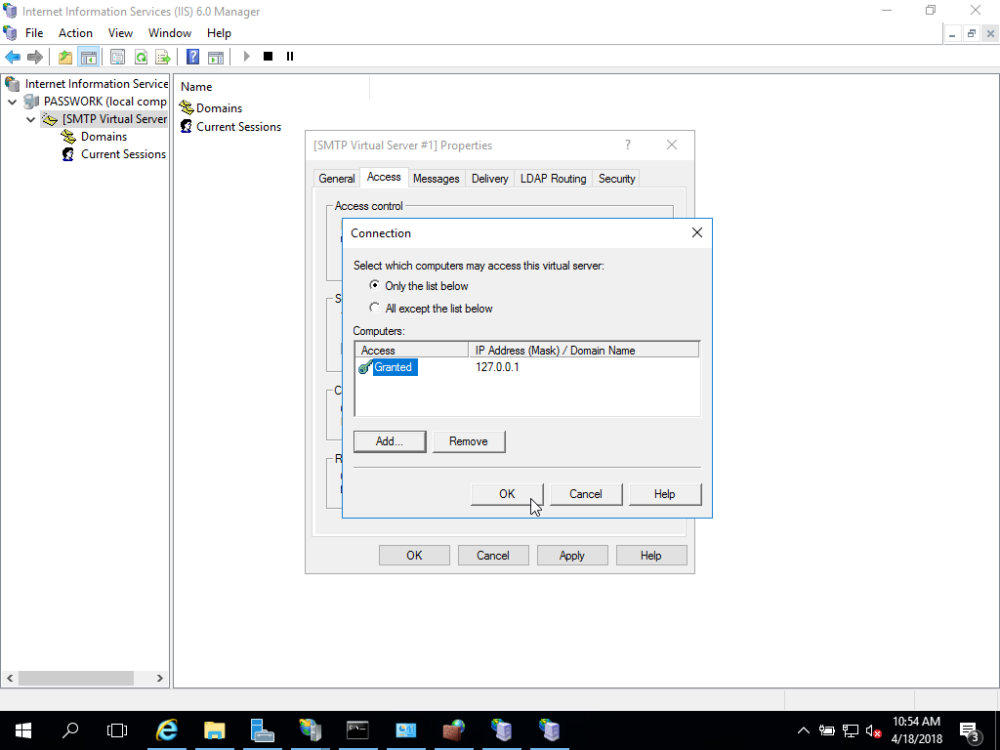

Click on “Access” tab > “Relay” and add 127.0.0.1 ip to granted computers list.

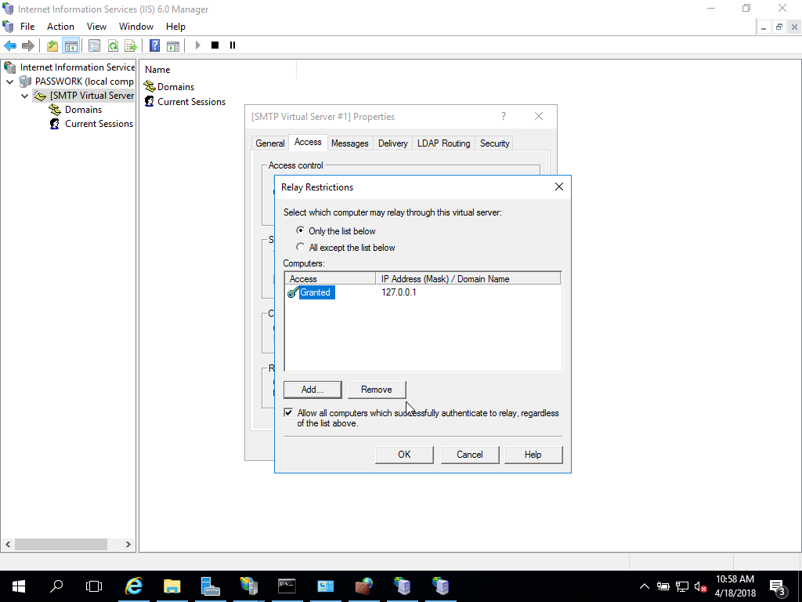


**Enable SMTP Server start on boot.**

Open Command Prompt - Press “Win+X”, then press “a” key. Run following commands:

```
powershell
```
```
set-service smtpsvc -StartupType Automatic
```


SMTP configuration completed.